# To Our Loves

# 0 情侣积分互动小程序

在[idofSunChonggao/Rainbow-Cats-Personal-WeChat-MiniProgram](https://github.com/idofSunChonggao/Rainbow-Cats-Personal-WeChat-MiniProgram) 的基础上进行开发, 感谢！

且感谢初版（[UxxHans/Rainbow-Cats-Personal-WeChat-MiniProgram](https://github.com/UxxHans/Rainbow-Cats-Personal-WeChat-MiniProgram)）！

改了还蛮多的，具体看界面展示吧~

零前端基础，全凭爱意。代码存在诸多不足和bug，仅供参考。

---

# 1 最新版本的界面展示

## 1.1 主页

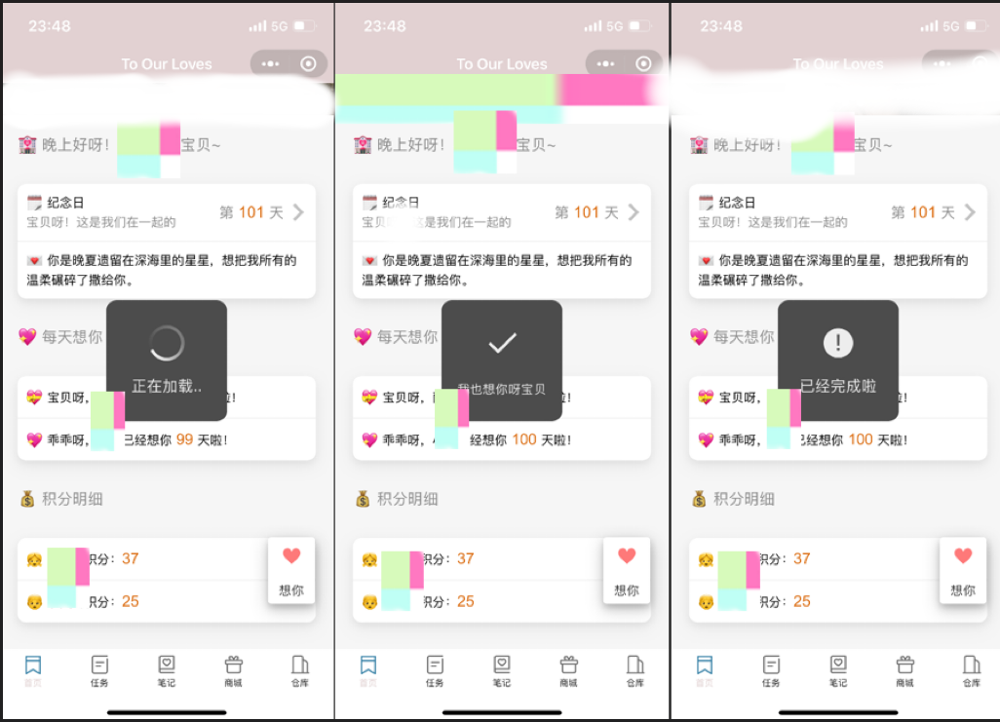

## 1.2 任务

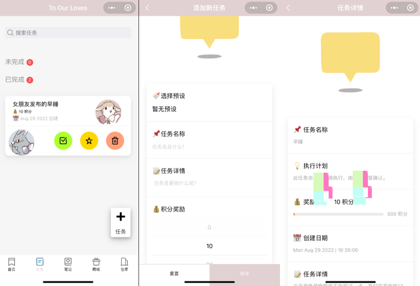


## 1.3 笔记

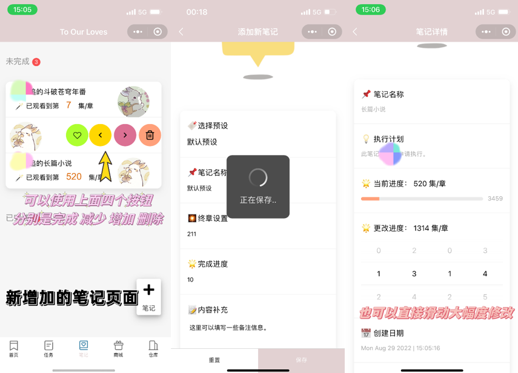

## 1.4 商城 && 仓库


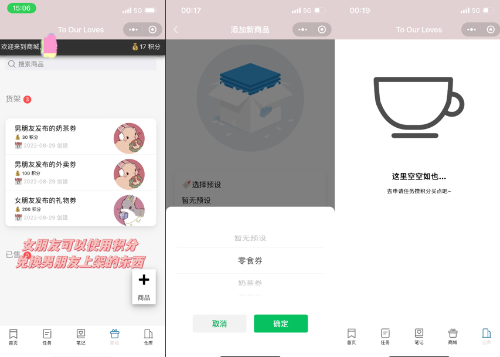

---

# 2 初步的部署指南

⭐⭐初步的部署指南的结果是 commits “初步部署Fix” 版本⭐⭐

⭐⭐这里的指南基于 idofSunChonggao 的版本 ⭐⭐

### 2.0 小程序注册账号以及设置相关

#### 2.0.0 小程序注册

https://mp.weixin.qq.com/wxopen/waregister?action=step1

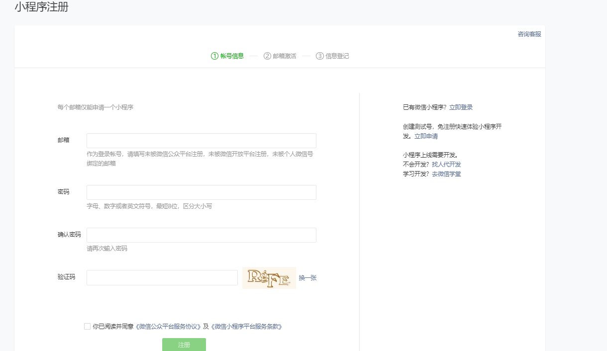

#### 2.0.1 登录开发

https://mp.weixin.qq.com/

⭐微信扫码 - 选择你的账户

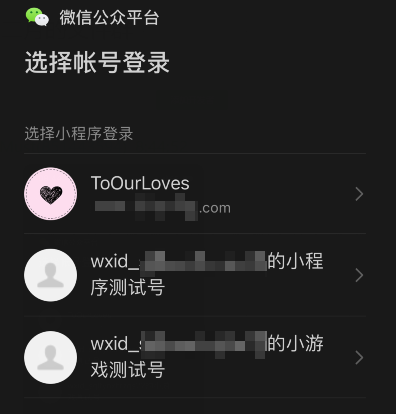

#### 2.0.2 开发流程

⭐去完成小程序信息以及小程序类目。

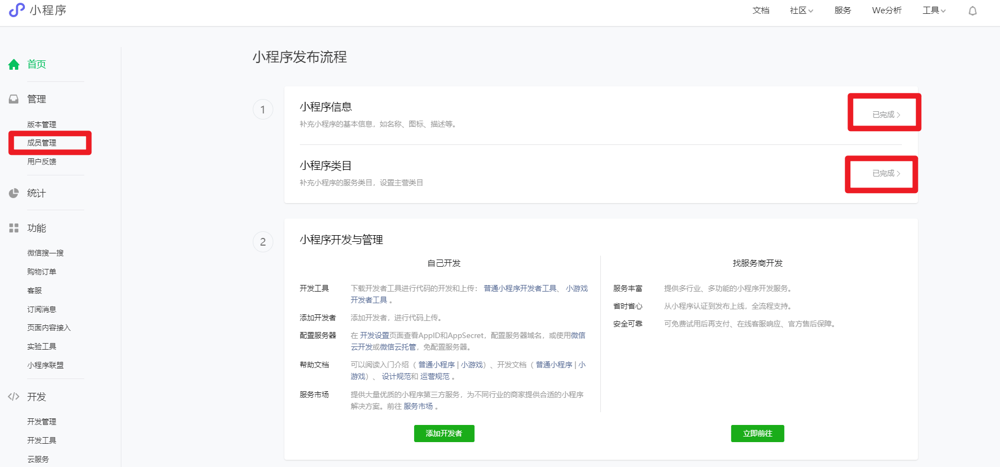

⭐再点击左侧成员管理，添加体验人员。


### 2.1 自己开发（微信云开发）

#### 2.1.1 下载开发者工具

https://developers.weixin.qq.com/miniprogram/dev/devtools/stable.html

#### 2.1.2 导入项目

```bash
# 克隆项目
git clone https://github.com/idofSunChonggao/Rainbow-Cats-Personal-WeChat-MiniProgram.git
```

⭐导入项目进入微信开发者工具。

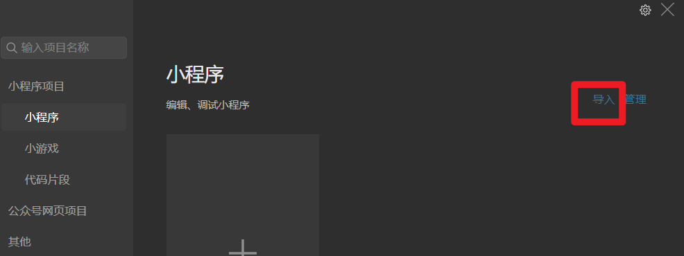

⭐选择文件夹

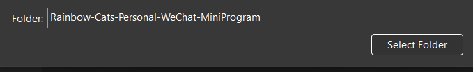

⭐选择好自己的AppID


#### 2.1.3 云开发设置

⭐进入后，点击 云开发


⭐进入后点击数据库->在集合名称添加四个集合：`MarketList`, `MissionList`, `StorageList`, `UserList`

⭐⭐⭐⭐⭐ 最新版的要添加更多集合

````js
MissionList
MarketList
StorageList
UserList
NoteList
````

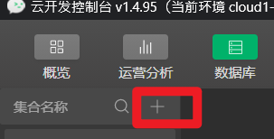

如下所示


⭐在`UserList`中添加两个默认记录, 在两个记录中分别添加两个字段 _openid与credit

```bash
字段 = _openid | 类型 = string | 值 = 先不填
字段 = credit  | 类型 = number | 值 = 0

⭐最新版本还需要
字段 = day  | 类型 = number | 值 = 0
字段 = missYou  | 类型 = number | 值 = 0
```

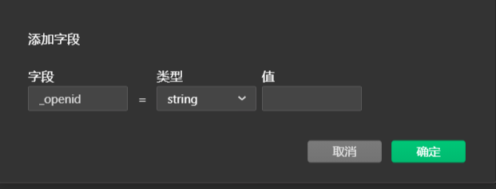

结果如下

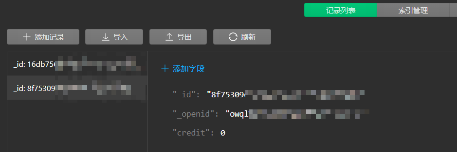

⭐⭐⭐⭐⭐ 最新版本的这里还需要添加几个字段

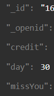

⭐设置 - 环境设置 - 复制环境ID

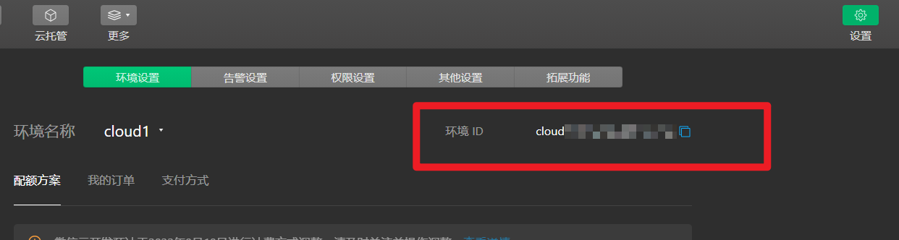


修改 miniprogram\envList.js 为：

```js
const envList = [{"envId":"cloud1-xxxxxxxxxxxxx","alias":"cloud"}]
module.exports = {
    envList,
}
```

⭐设置好编辑器云函数根目录(cloudfunctionRoot)

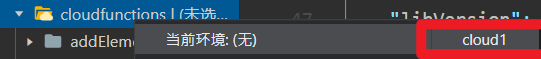

⭐右键点击 cloudfunctions 中的每个文件夹并选择云函数云端安装依赖上传 (不上传 node_modules), 一共九个。

⭐⭐⭐⭐⭐ 最新版本的要上传更多，而wx小程序有限制数量，所以需要开个套餐

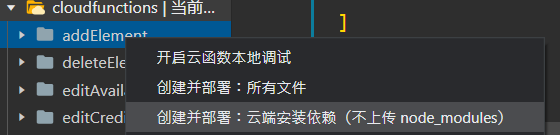

结果：

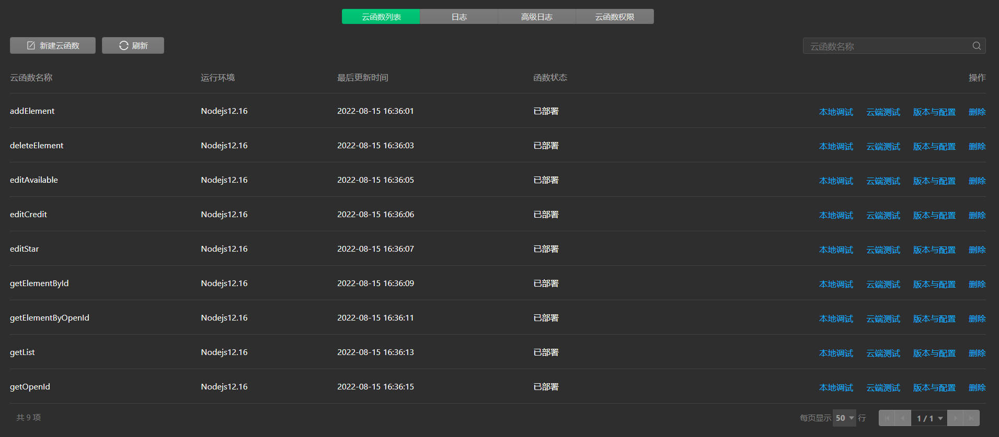

⭐点击真机调试，出现

Error: miniprogram_npm/weui-miniprogram/icon/icon.js does not exists [1.05.2204250][win32-x64]

可能git clone 没把它下下来，自己去专门复制一个这份文件，并放到相应目录下。

⭐没有安装npm或者NodeJs, 需要先在这里下载安装: https://nodejs.org/dist/v16.15.1/node-v16.15.1-x64.msi

⭐win+R 打开cmd，安装相关

到cloudfunctions里执行

```bash
npm install --save wx-server-sdk@latest

npm init -y
```

如图所示：

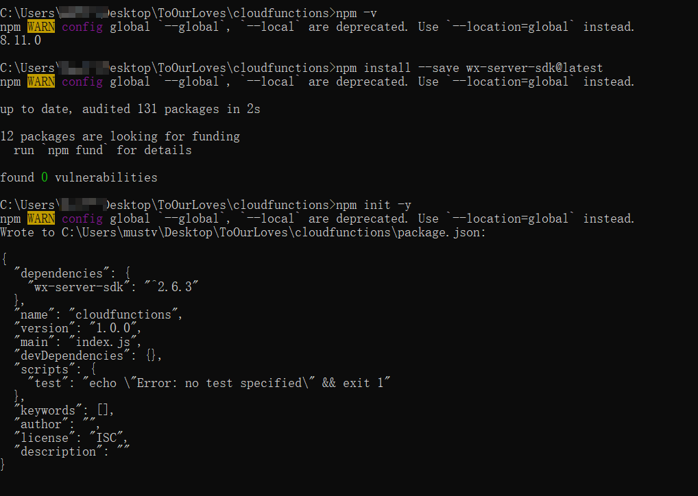

⭐再对miniprogram\pages\MainPage\index.wxml 进行修改，可以编译通过一个没有错误的demo

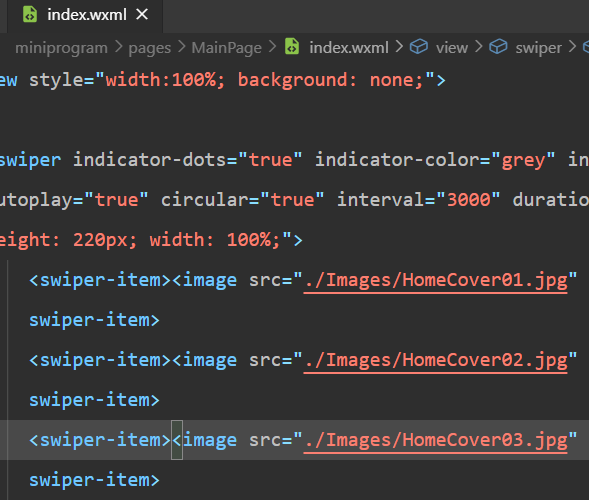

⭐点击上传


⭐再回到https://mp.weixin.qq.com/ 的版本管理里，将开发版本设置为体验版。

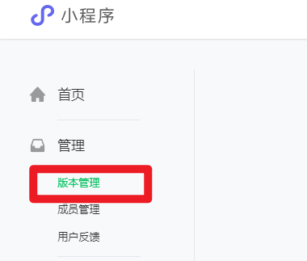


⭐然后通过开发者账号分享到男/女朋友手机上(要先登录小程序开发者账号)。

⭐在两个手机上运行小程序->分别在两个手机上的小程序里新建任务。

⭐然后回到云开发控制台的missionlist数据库集合->找自己和男/女朋友的openid变量并记录。

⭐把这两个记录下来的拷贝到云开发控制台UserList数据集合里刚刚没填的openid变量中。

⭐把这两个记录下来的openid拷贝到miniprogram/app.js里的openidA和openidB的值里(A是小明，B是小红)。

⭐在miniprogram/app.js里把userA和userB改成自己和男/女朋友的名字。

⭐在miniprogram/app.js里把date改成自己和男/女朋友的恋爱纪念日。

⭐然后再试试看是不是成功了! (别忘了任务和物品左滑可以完成和购买)。

⭐别忘了最后点击右上角上传->然后在开发者账号上设置小程序为体验版->不用去发布去审核。


---

# 3 进一步的修改参考

| 内容                 | 位置                                                         | 关键词定位                                                   |
| -------------------- | ------------------------------------------------------------ | ------------------------------------------------------------ |
| 时间                 | miniprogram\app.js                                           | date: '2000/1/1 00:00:00',                                   |
| 名字                 | miniprogram\app.js                                           | //记录使用者的名字                                           |
| openid               | miniprogram\app.js                                           | //记录使用者的openid                                         |
| 主题颜色             | miniprogram\app.json                                         | navigationBarBackgroundColor                                 |
| 图片滚动小球的颜色   | miniprogram\pages\MainPage\index.wxml                        | selectedColor                                                |
| 主页最上方标题       | miniprogram\app.json                                         | indicator-active-color                                       |
| 每日一句             | miniprogram\pages\MainPage\index.js                          | sentences: [                                                 |
| 首页图片             | miniprogram\pages\MainPage\index.wxml                        | ./Images/HomeCover01.jpg                                     |
| 商城页的图片         | miniprogram\pages\Market\Images                              |                                                              |
| 任务页的图片         | miniprogram\pages\Mission\Images                             |                                                              |
| 仓库页的图片         | miniprogram\pages\Account\Images                             |                                                              |
| 商城里，券是谁发布的 | miniprogram\pages\Market\index.wxml                          | <view class="item-info_title">                               |
| 商品详情里，谁发布的 | miniprogram\pages\MarketDetail\index.js                      | from_who:                                                    |
| 添加页面             | miniprogram\app.json                                         | pages                                                        |
| 添加存储List         | miniprogram\app.js                                           | 用于存储待办记录的集合名称                                   |
| 修改存储List         | miniprogram\pages\RecodeDetail<br />miniprogram\pages\RecodeAdd<br />miniprogram\pages\Recode<br />的js文件 | 三个页面对应的collectionRecodeList                           |
| 添加下方新按键       | miniprogram\app.json                                         | tabBar                                                       |
| 左滑图标icon         | https://github.com/wechat-miniprogram/weui-miniprogram/blob/master/docs/icon.md<br />https://fonts.google.com/icons?selected=Material+Icons | 下载到 ToOurLoves\miniprogram<br />\miniprogram_npm\weui-miniprogram\slideview\Images |
| 修改跳转             | miniprogram\pages\Recode\index.js                            | navigateTo                                                   |
| 判断添加进行显示     | miniprogram\pages\Recode\index.wxml                          | allMissions.length                                           |
| 选择颜色             | https://developers.weixin.qq.com/miniprogram/dev/api/canvas/Color.html |                                                              |
| 增加一些变量         | cloudfunctions\addElement\index.js<br />需要同时将这个云函数上传更新，以及所有调用addElement这个云函数的地方需要进行初始化<br />例如miniprogram\pages\MarketAdd\index.js 里需要有增加的变量的初始值<br />特别注意 pages\Market\index.js 这里也有添加东西到仓库 | credit、chapterNum<br />wx.cloud.callFunction({name: 'addElement' |
| 更改章节数           | 加云函数，并上传它<br />cloudfunctions\editChapterNum\package.json 改函数名字<br />cloudfunctions\editChapterNum\index.js 改相关逻辑<br />miniprogram\pages\Note\index.js 改相关逻辑 定位词见后<br />云函数开发参考：<br />https://developers.weixin.qq.com/miniprogram/dev/wxcloud/guide/database/update.html | else if (index === 2)                                        |
| 滚动条设置           | https://developers.weixin.qq.com/miniprogram/dev/component/picker-view.html | picker-view                                                  |
|                      |                                                              |                                                              |


# 4 感谢

一些图片来源：

http://mof.chu.jp/icon.html?ref=uiset

https://emojipedia.org/

一些开发参考：

https://developers.weixin.qq.com/miniprogram/dev/framework/

忘记记录了...
